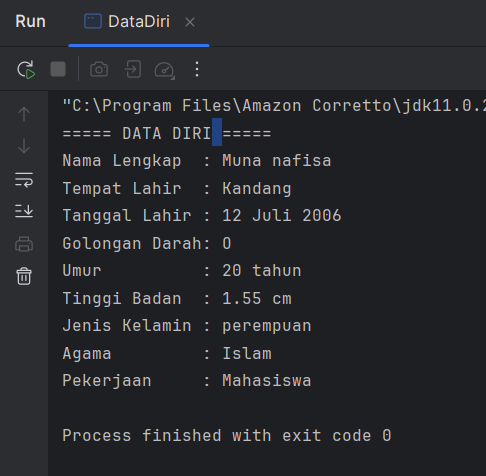
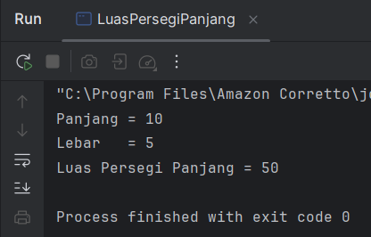
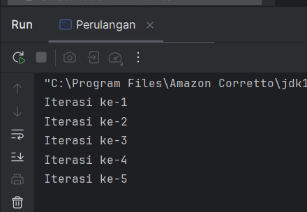

# Laporan Modul 8: Abstraction
**Mata Kuliah:** Praktikum Pemrograman Berorientasi Objek   
**Nama:** [Muna Nafisa]  
**NIM:** [2024573010048]  
**Kelas:** [TI2A]

## 1. Abstrak
Java adalah bahasa pemrograman berorientasi objek yang populer dan banyak digunakan untuk pengembangan aplikasi desktop, web, dan mobile. Java menggunakan sintaks yang mirip dengan C++ tetapi dirancang untuk lebih mudah dipahami dan digunakan.

Untuk memulai pemrograman Java, Anda perlu:

JDK (Java Development Kit): Berisi compiler dan tools untuk mengembangkan program Java.
IDE (Integrated Development Environment): Seperti IntelliJ IDEA, Eclipse, atau NetBeans untuk menulis dan menjalankan kode.ternal suatu komponen tanpa memengaruhi komponen lain yang berinteraksi dengan komponen tersebut, asalkan interface yang digunakan tetap konsisten.

#### Langkah Praktikum

**Praktikum 1

1. Buat sebuah package baru di dalam folder src dengan cara klik kanan pada folder src kemudian pilih New -> Package. Beri nama modul_1.
2. Buat Sebuah class didalam package modul_1 dengan cara klik kanan dan pilih New -> Java Class. Beri nama HelloWorld
   3.  Isikan kode dibawah ini.

           package Praktikum_1;
        
           public class HelloWorld {
           public static void main (String[] args){
           System.out.println("Hello, World!!");
           }
           }
                    
4. Jalankan program 

## 2. Variabel dan Tipe Data

Variabel digunakan untuk menyimpan data dalam program.

### Langkah praktikum

1. Buat sebuah class baru di dalam package modul_1 dan beri nama Variable
2. Tuliskan kode berikut:

         package Praktikum_1;
        
         public class Variable {
         public static void main(String [] args) {
         int umur = 20;
         double tinggi = 1.80;
         boolean isMahasiswa = true;
         char jeniskelamin = 'L';
         String nama = "Budi";

         System.out.println("Nama: " + nama );
         System.out.println("umur:" +umur);
         System.out.println("tinggi:" +tinggi);
         System.out.println("mahasiswa:" + isMahasiswa);
         System.out.println("jenis kelamin: + jeniskelamin");
             }
         }

3. Jalankan program nya untuk melihat hasil.

**Latihan**

1. Buatlah program untuk menampilkan data diri anda yang lengkap dengan attribut seperti berikut:
   Nama Lengkap, Tempat Lahir, Tanggal Lahir, Golongan Darah, Umur,
   Tinggi Badan, Jenis Kelamin, Agama, Pekerjaan.

            package Praktikum_1.Latihan;
    
        public class DataDiri {
    
            public static void main(String[] args) {
    
                String namaLengkap = "Muna nafisa";
                String tempatLahir = "Kandang";
                String tanggalLahir = "12 Juli 2006";
                String golonganDarah = "O";
                int umur = 20;
                double tinggiBadan =1.55;
                String jenisKelamin = "perempuan";
                String agama = "Islam";
                String pekerjaan = "Mahasiswa";
    
                System.out.println("===== DATA DIRI =====");
                System.out.println("Nama Lengkap  : " + namaLengkap);
                System.out.println("Tempat Lahir  : " + tempatLahir);
                System.out.println("Tanggal Lahir : " + tanggalLahir);
                System.out.println("Golongan Darah: " + golonganDarah);
                System.out.println("Umur          : " + umur + " tahun");
                System.out.println("Tinggi Badan  : " + tinggiBadan + " cm");
                System.out.println("Jenis Kelamin : " + jenisKelamin);
                System.out.println("Agama         : " + agama);
                System.out.println("Pekerjaan     : " + pekerjaan);
            }
        }

**output**

## 3. Operator dan Expressi 

Operator digunakan untuk melakukan operasi pada variabel dan nilai. Jenis operator:

Aritmatika: +, -, *, /, %

Perbandingan: ==, !=, >, <, >=, <=

Logika: && (AND), || (OR), ! (NOT)

### Langkah Praktikum

1. Buat sebuah class baru di dalam package modul_1 dan beri nama Operator
2. Tuliskan kode berikut:

        package Praktikum_1;
        
        public class Operator {
        public static void main (String[] args) {
        int a = 10;
        int b = 5;
        
                System.out.println("a + b = " + (a + b));
                System.out.println("a > b? =" + (a > b));
                System.out.println("a== b?=" + (a == b));
            }
        }

3. Jalankan program nya untuk melihat hasil.

**Latihan**

1. Buat program untuk menghitung luas persegi panjang (panjang * lebar)

        package Praktikum_1.Latihan;
        
        public class LuasPersegiPanjang {
        
            public static void main(String[] args) {
        
                int panjang = 10;
                int lebar = 5;
        
                int luas = panjang * lebar;
        
                System.out.println("Panjang = " + panjang);
                System.out.println("Lebar   = " + lebar);
                System.out.println("Luas Persegi Panjang = " + luas);
            }
        }
**output**

## 4. Percabangan (If-Else dan Switch-Case)

Percabangan digunakan untuk mengambil keputusan berdasarkan kondisi.

## Langkah Praktikum

1. Buat sebuah class baru di dalam package modul_1 dan beri nama Percabangan
2. Tuliskan kode berikut:

        package Praktikum_1;
        
        public class Percabangan {
        public static void main(String[] args) {
        int nilai = 85;
        
                if (nilai >= 75) {
                    System.out.println("Anda lulus!");
                } else {
                    System.out.println("Anda tidak lulus.");
                }
            }
        }

3. Jalankan program nya untuk melihat hasil.

**latihan**

1. Buat program untuk menentukan apakah suatu bilangan genap atau ganjil.

        package Praktikum_1.Latihan;
        
        public class BilanganGenapGanjil {
        
                public static void main(String[] args) {
        
                    int angka = 7;
        
                    if (angka % 2 == 0) {
                        System.out.println(angka + " adalah bilangan genap.");
                    } else {
                        System.out.println(angka + " adalah bilangan ganjil.");
                    }
        
                }
            }

**Output**

## 5. Perulangan (For, While, Do-While)

Perulangan digunakan untuk mengulang blok kode.

## langkah Praktikum

1. Buat sebuah class baru di dalam package modul_1 dan beri nama Perulangan
2. Tuliskan kode berikut:

        package Praktikum_1;
        
        public class Perulangan {
        public static void main(String[] args) {
        for (int i = 1; i <= 5; i++) {
        System.out.println("Iterasi ke-" + i);
        }
        }
        }

3. Jalankan program nya untuk melihat hasil.
   

**Latihan**

1. Buat program untuk mencetak bilangan ganjil dari 1 hingga 20. Buat 3 program dengan menggunakan for, while, do-while.

**menggunakan for**

    package Praktikum_1.Latihan;
    
    public class BilanganGanjilFor {
    public static void main(String[] args) {
    
            for (int i = 1; i <= 20; i++) {
                if (i % 2 != 0) {
                    System.out.print(i + " ");
                }
            }
    
        }
    }

**output**

**menggunakan while**

    package Praktikum_1.Latihan;
    
    public class BilanganGanjilWhile {
    
        public static void main(String[] args) {
    
            int i = 1;
    
            while (i <= 20) {
                if (i % 2 != 0) {
                    System.out.print(i + " ");
                }
                i++;
            }
    
        }
    }

**output**

**menggunakan Do-While**

    package Praktikum_1.Latihan;
    
    public class BilanganGanjilDo_While {
    public static void main(String[] args) {
    
                int i = 1;
    
                do {
                    if (i % 2 != 0) {
                        System.out.print(i + " ");
                    }
                    i++;
                } while (i <= 20);
    
            }
        }

**output**

## 6. Practice Problem dan Solusinya

Practice Problem:

Buat program untuk menghitung faktorial dari suatu bilangan.

Buat program untuk mengecek apakah suatu bilangan adalah bilangan prima.

Buat program untuk mencetak pola segitiga menggunakan *.

**Solusi**

1. Buat sebuah class baru di dalam package modul_1 dan beri nama Factorial dan isikan kode berikut. 

Kemudian jalankan untuk melihat hasilnya.

    package Praktikum_1;
    
    public class Faktorial {
    public static void main(String[] args) {
    int n = 5;
    int hasil = 1;
    
                for (int i = 1; i <= n; i++) {
                    hasil *= i;
                }
    
                System.out.println("Faktorial dari " + n + " adalah " + hasil);
            }
        }
**Output**

2. Buat sebuah class baru di dalam package modul_1 dan beri nama Prima dan isikan kode berikut. Kemudian jalankan untuk melihat hasilnya.

        package Praktikum_1;
        
        public class Prima {
        public static void main(String[] args) {
        int n = 7;
        boolean isPrima = true;
        
                    for (int i = 2; i <= n / 2; i++) {
                        if (n % i == 0) {
                            isPrima = false;
                            break;
                        }
                    }
        
                    System.out.println(n + (isPrima ? " adalah bilangan prima." : " bukan bilangan prima."));
                }
            }

**Output**

3. Buat sebuah class baru di dalam package modul_1 dan beri nama Segitiga dan isikan kode berikut. Kemudian jalankan untuk melihat hasilnya.

        package Praktikum_1;
        
        public class Segitiga {
        public static void main(String[] args) {
        int tinggi = 5;
        
                    for (int i = 1; i <= tinggi; i++) {
                        for (int j = 1; j <= i; j++) {
                            System.out.print("* ");
                        }
                        System.out.println();
                    }
                }
            }

**Output**

#### Analisa dan Pembahasan

**PRAKTIKUM 1**

**1.Class Circle**

1. Class Declaration

        public class Circle extends Shape

- Circle adalah subclass dari abstract class Shape.

- Karena Shape class abstrak, wajib mengoverride method abstract di dalamnya.

2. Attribute

          private double radius;

- Menyimpan nilai jari-jari lingkaran.

- private → hanya bisa diakses dari dalam class.

3. Constructor

        public Circle(String color, boolean filled, double radius) {
        super(color, filled);
        this.radius = radius;
        }
- Menerima 3 parameter: color, filled, dan radius.

- super(color, filled) → memanggil constructor milik Shape.

    - Berarti Shape punya atribut warna dan apakah shape tersebut "filled" atau tidak.

- this.radius = radius → menyimpan radius ke atribut class.

4. Override Method Abstract dari Shape

a. calculateArea

    @Override
    public double calculateArea() {
    return Math.PI * radius * radius;
    }
- Menghitung luas lingkaran: π r²

- Implementasi konkret dari method abstract di class induk.

b. calculatePerimeter

    @Override
    public double calculatePerimeter() {
    return 2 * Math.PI * radius;
    }
- Menghitung keliling lingkaran: 2 π r

5. Override displayInfo

        @Override
        public void displayInfo() {
        System.out.println("CIRCLE");
        super.displayInfo();
        System.out.println("Radius: " + radius);
        System.out.println("Area: " + calculateArea());
        System.out.println("Perimeter: " + calculatePerimeter());
        System.out.println("===============");
        }
- Menampilkan info lingkaran.

- super.displayInfo() → memanggil method display dari class Shape.

- Biasanya berisi informasi color dan filled.

- Menampilkan radius, luas, dan keliling.

- Bagus untuk menunjukkan polimorfisme runtime: tiap shape punya cara tampil berbeda.

6. Method Khusus

        public double getDiameter() {
        return 2 * radius;
        }
- Method tambahan yang hanya dimiliki lingkaran.

- Menghitung diameter = 2r.

**2. CLASS Rectangle**

1. Class Declaration

        public class Rectangle extends Shape

- Rectangle adalah subclass dari abstract class Shape.

- Karena Shape adalah abstract, maka class ini wajib override method abstract calculateArea() dan calculatePerimeter().

2. Attribute

        private double width;
        private double height;

- width → lebar persegi panjang

- height → tinggi persegi panjang

- Keduanya private, hanya bisa diakses dalam class.

3. Constructor

        public Rectangle(String color, boolean filled, double width, double height) {
        super(color, filled);
        this.width = width;
        this.height = height;
        }

- Mengambil data dari user: color, filled, width, height.

- super(color, filled) → memanggil constructor di class induk (Shape).
  Ini mengisi atribut warna dan kondisi filled.

- this.width = width dan this.height = height menyimpan nilai ke atribut class.

4. Implementasi Method Abstract

a. Menghitung luas

    @Override
    public double calculateArea() {
    return width * height;
    }
b. Menghitung keliling

    @Override
    public double calculatePerimeter() {
    return 2 * (width + height);
    }

5. Override displayInfo()

        @Override
        public void displayInfo() {
        System.out.println("RECTANGLE");
        super.displayInfo();
        System.out.println("Width: " + width);
        System.out.println("Height: " + height);
        System.out.println("Area: " + calculateArea());
        System.out.println("Perimeter: " + calculatePerimeter());
        System.out.println("-----------------------");
        }

- Fungsi ini:

    - Menampilkan judul “RECTANGLE”.

    - Memanggil method displayInfo() milik Shape → biasanya menampilkan color & filled.

    - Menampilkan atribut width, height, luas, dan keliling.

    - Dipakai saat program menampilkan info objek.

6. Method Tambahan: isSquare()

        public boolean isSquare() {
        return width == height;
        }

- Method ini mengecek apakah persegi panjang adalah persegi.

- Jika lebar == tinggi → return true.

Contoh:

- width = 5, height = 5 → persegi → true

- width = 5, height = 7 → bukan persegi → false

Method ini hanya dimiliki Rectangle, bukan Shape lain.

**3. Class shape**

1. Class Declaration

        public abstract class Shape

- Class ini adalah abstract class, artinya:

    - Tidak bisa dibuat objek langsung → new Shape()

    - Hanya bisa digunakan sebagai blueprint untuk subclass (Circle, Rectangle, Triangle, dll).

    - Wajib memiliki minimal satu abstract method.

Merupakan “kerangka dasar” semua bentuk bangun.

2. Atribut

        protected String color;
        protected boolean filled;

- color → warna dari shape.

- filled → apakah bentuk tersebut terisi (fill) atau tidak.

Kenapa protected?

- Agar atribut dapat diakses oleh subclass (Circle, Rectangle, dll), tetapi tetap tidak sepenuhnya public.

Ini adalah contoh encapsulation yang tepat untuk hierarki OOP.

3. Constructor

        public Shape(String color, boolean filled) {
        this.color = color;
        this.filled = filled;
        }

- Constructor menerima warna dan kondisi filled.

- Diset sekali saat objek turunan dibuat.

4. Abstract Methods

        public abstract double calculateArea();
        public abstract double calculatePerimeter();

- Semua subclass WAJIB mengimplementasikan:

    - Luas

    - Keliling

Contoh implementasi di Circle:

    public double calculateArea() {
    return Math.PI * radius * radius;
    }
Contoh di Rectangle:

        public double calculateArea() {
        return width * height;
        }

Ini bagian inti dari polimorfisme → setiap bentuk punya cara sendiri untuk menghitung luas & keliling.

5. Concrete Methods (bukan abstract)

Getter dan Setter:

    public String getColor() { ... }
    public void setColor(String color) { ... }
    public boolean isFilled() { ... }
    public void setFilled(boolean filled) { ... }

- Memberikan akses aman ke atribut.

- Sesuai prinsip Encapsulation.

6. Method displayInfo()

        public void displayInfo() {
        System.out.println("Shape Color: " + color);
        System.out.println("Filled: " + filled);
        }

Fungsi:

- Menampilkan info dasar sebuah shape.

- Method ini bisa:

    - Digunakan langsung oleh subclass → seperti Circle dan Rectangle memanggil super.displayInfo()

    - Atau dioverride jika subclass ingin tampil beda.

Contoh di Circle:

    System.out.println("CIRCLE");
    super.displayInfo();

Jadi displayInfo() memberi dasar info — subclass menambah detail lain.

**4. CLASS AbstractClassTest**

1. Membuat Objek Circle dan Rectangle

        Circle circle = new Circle("Red", true, 5.0);
        Rectangle rectangle = new Rectangle("Blue", false, 4.0, 6.0);
- Membuat objek Circle dan Rectangle dengan warna, status filled, dan ukuran.

- Ini menggunakan constructor yang sudah dibuat di masing-masing class.

2. Demonstrasi Abstract Class + Polymorphism

        Shape shape1 = circle;
        Shape shape2 = rectangle;

- Variabel tipe induk (Shape) bisa menyimpan objek subclass (Circle dan Rectangle).

- Ini polimorfisme runtime:
  Method yang dipanggil mengikuti objek aslinya (Circle/Rectangle), bukan tipe referensinya.

Contoh:

    shape1.displayInfo(); // Punya Circle
    shape2.displayInfo(); // Punya Rectangle

Walaupun tipe variabel adalah Shape, method yang berjalan tetap milik subclass.

3. Memanggil Method Polimorfik

        shape1.displayInfo();
        shape2.displayInfo();

- Akan memanggil override method displayInfo() di masing-masing class:

    - Circle → menampilkan radius, area, perimeter

    - Rectangle → menampilkan width, height, area, perimeter

4. Memanggil Method Khusus Subclass

        System.out.println("Circle Diameter: " + circle.getDiameter());
        System.out.println("Is Rectangle Square? " + rectangle.isSquare());

Ini hanya bisa dipanggil dari objek aslinya, bukan variabel Shape.

Karena:

- getDiameter() hanya dimiliki Circle

- isSquare() hanya dimiliki Rectangle
  Jika dipanggil lewat shape1, error.

5. Demonstrasi Array of Shapes (Polymorphism Level Lanjut)

        Shape[] shapes = new Shape[3];
        shapes[0] = new Circle("Green", true, 3.0);
        shapes[1] = new Rectangle("Yellow", true, 5.0, 5.0);
        shapes[2] = new Circle("Purple", false, 7.0);
Ini sangat penting:

- Array bertipe Shape

- Isinya berbagai objek turunan (Circle dan Rectangle)

- Ini menunjukkan polimorfisme di koleksi objek

6. Looping Polimorfik

        for (Shape shape : shapes) {
        shape.displayInfo();
        totalArea += shape.calculateArea();
        System.out.println();
        }

- Kekuatan polimorfisme:

    - shape.displayInfo() memanggil versi Circle atau Rectangle sesuai objek dalam array.

    - shape.calculateArea() akan otomatis menghitung luas sesuai tipe objeknya.

Walaupun variabelnya bertipe Shape, method di subclass yang berjalan.

7. Menjumlahkan Luas Semua Objek

        System.out.println("Total Area of All Shapes: " + totalArea);

- Menggabungkan seluruh luas dari objek Circle dan Rectangle.

- Menunjukkan kegunaan polimorfisme untuk operasi generic.

**Praktikum 2: Memahami Interface**

**1. Class Car**

1. Class Declaration

    public class Car implements Vehicle

- Car mengimplementasikan interface Vehicle.

- Artinya class ini wajib meng-override semua method yang ada di interface.

- Car bukan abstract → semua method harus lengkap.

2. Atribut

a. brand

- Menyimpan merk mobil (contoh: Toyota, Honda)

b. currentSpeed

- Menyimpan kecepatan mobil saat ini.

c. isRunning

- Menyimpan status apakah mobil sedang menyala atau tidak.

Atribut menggunakan private → encapsulation.

3. Constructor

        public Car(String brand) {
        this.brand = brand;
        this.currentSpeed = 0;
        this.isRunning = false;
        }
- Saat objek Car dibuat:

    - Speed = 0

    - Mobil dalam keadaan off

    - Brand ditentukan dari parameter

4. Implementasi Method dari Interface Vehicle

A. start()

    @Override
    public void start() {
    if (!isRunning) {
    isRunning = true;
    System.out.println(brand + " car started");
    } else {
    System.out.println(brand + " car is already running");
    }
    }

- Menyalakan mobil jika belum menyala.

- Mengubah isRunning = true.

- Jika sudah menyala, tampilkan pesan bahwa mobil sudah hidup.

B. stop()

    @Override
    public void stop() {
    if (isRunning) {
    isRunning = false;
    currentSpeed = 0;
    System.out.println(brand + " car stopped");
    } else {
    System.out.println(brand + " car is already stopped");
    }
    }

- Mematikan mobil jika sedang hidup.

- Speed otomatis menjadi 0.

- Jika sudah mati → tampilkan pesan.

C. accelerate(double speed)

    @Override
    public void accelerate(double speed) {
    if (isRunning) {
    currentSpeed += speed;
    if (currentSpeed > MAX_SPEED)
    currentSpeed = MAX_SPEED;
    
            System.out.println(brand + " car accelerating to " + currentSpeed + " km/h");
        } else {
            System.out.println("Please start the car first");
        }
    }
- Mobil hanya bisa nambah kecepatan jika hidup.

- Menambah speed sebesar parameter.

- Jika lebih tinggi dari MAX_SPEED, otomatis diset ke MAX_SPEED.

MAX_SPEED adalah constant dari interface Vehicle.

D. brake()

    @Override
    public void brake() {
    if (currentSpeed > 0) {
    currentSpeed -= 10;
    if (currentSpeed < 0) currentSpeed = 0;
    
            System.out.println(brand + " car braking to " + currentSpeed + " km/h");
        } else {
            System.out.println(brand + " car is already stopped");
        }
    }
- Mengurangi speed 10 km/h setiap kali rem ditekan.

- Jika speed < 0, set ke 0.

- Jika speed sudah 0, tampilkan pesan bahwa mobil sudah berhenti.

5. Getter Methods

        public String getBrand() { return brand; }
        public double getCurrentSpeed() { return currentSpeed; }
        public boolean isRunning() { return isRunning; }

- Mengambil data private variable sesuai prinsip encapsulation.

- Tidak ada setter → keamanan lebih terjaga.

**2. Class Electric**

1. Deklarasi Interface

        public interface Electric {

- Electric adalah interface, bukan class.

- Interface digunakan untuk menentukan kontrak perilaku.

- Semua class yang mengimplementasi Electric wajib menyediakan method‐method yang didefinisikan (kecuali method default).

2. Method Abstract

Interface ini memiliki 3 method abstract:

2.1. void charge();

- Method tanpa body → harus diimplementasikan oleh class yang memakai interface ini.

- Fungsinya biasanya:

    - Mengisi baterai

    - Atau menjalankan proses charging

2.2. int getBatteryLevel();

- Method getter untuk mengambil level baterai saat ini.

- Return tipe int, contoh nilai: 0–100.

2.3. void setBatteryLevel(int level);

- Method setter untuk mengubah nilai baterai.

- Umumnya digunakan untuk update level saat charging atau memakai energi.

4. Default Method

        default void displayBatteryInfo() {
        System.out.println("Battery Level: " + getBatteryLevel() + "%");
        }
- Ini adalah default method, fitur sejak Java 8.

- Default method memiliki implementasi sehingga:

    - Class turunan tidak wajib override.

    - Tapi boleh override kalau ingin tampilan berbeda.

- Method ini otomatis memanggil getBatteryLevel() dan menampilkan informasi baterai.

Contoh Penggunaan di Class

    public class ElectricCar implements Electric {
    private int batteryLevel;
    
        public ElectricCar() {
            batteryLevel = 50;
        }
    
        @Override
        public void charge() {
            batteryLevel = 100;
        }
    
        @Override
        public int getBatteryLevel() {
            return batteryLevel;
        }
    
        @Override
        public void setBatteryLevel(int level) {
            batteryLevel = level;
        }
    }

**3. CLASS ElectricCar**

1. Atribut / Properti

    private String brand;
    private double currentSpeed;
    private boolean isRunning;
    private int batteryLevel;

- brand → merek mobil, contoh: Tesla, Wuling, Hyundai

- currentSpeed → kecepatan mobil saat ini

- isRunning → menandakan mobil hidup / tidak

- batteryLevel → level baterai (0–100%)

2. construktor

        public ElectricCar(String brand) {
        this.brand = brand;
        this.currentSpeed = 0;
        this.isRunning = false;
        this.batteryLevel = 100;
        }

Saat objek dibuat:
- Kecepatan awal = 0

- Mesin = mati

- Baterai = 100% (full charge)

- Brand diambil dari parameter

3. Implementasi Interface Vehicle

1. start()

        if (batteryLevel > 0) {
        if (!isRunning) {
        isRunning = true;
        System.out.println(brand + " electric car started silently");
        }
        }
- Mobil hanya bisa menyala jika baterai > 0

- Menggunakan kondisi untuk mencegah start dua kali

- Output khas mobil listrik: silent start

2. stop()

        if (isRunning) {
        isRunning = false;
        currentSpeed = 0;
        System.out.println(brand + " electric car stopped");
        }
- Mesin dimatikan

- Kecepatan otomatis kembali ke 0

3. accelerate(double speed)

- Hanya bisa mempercepat ketika:

    - Mobil sedang berjalan (isRunning == true)

    - Baterai masih ada

- Menambah kecepatan berdasarkan parameter speed

- Mengkonsumsi baterai:

      batteryLevel -= (int)(speed / 10);

- Ada batas kecepatan MAX_SPEED (dari interface Vehicle)

- Menampilkan update kecepatan dan baterai

Catatan OOP:

- Integrasi antara motor listrik dan konsumsi energi

- Logika realistis untuk kendaraan EV

4. brake()

Penjelasan penting:

- Brem mengurangi kecepatan 10 km/h

- Ada batas bawah 0

- Fitur Regenerative Braking

      batteryLevel += 2;

Menambah baterai saat pengereman → sesuai konsep mobil listrik a

5. honk() — Override Default Method

Karena Vehicle mungkin punya default honk, maka class ini mengoverride:

    @Override
    public void honk() {
    System.out.println("Electric beep! ⚡");
    }

Memberikan karakter khas suara mobil listrik.

4. Implementasi Interface Electric

1. charge()

         batteryLevel = 100;

- Mengisi baterai hingga penuh

- Output: mobil terisi penuh

2. getBatteryLevel()

Mengambil level baterai saat ini

3. setBatteryLevel(int level)

- Memastikan nilai baterai valid (0–100)

- Melindungi kendaraan dari input yang tidak mungkin

5. Getter Tambahan

            public String getBrand()
               public double getCurrentSpeed()
               public boolean isRunning()

- Tujuan:

    - Enkapsulasi

    - Pengambilan data objek tanpa memodifikasi

**4. CLASS Vehicle**

1. Constant Field (public static final)

        int MAX_SPEED = 200;

- Semua field di interface otomatis bersifat public static final, meskipun tidak ditulis.

- Artinya:

    - MAX_SPEED adalah konstanta bersama untuk semua kendaraan.

    - Tidak bisa diubah (final).

    - Bisa diakses langsung: Vehicle.MAX_SPEED.

- Fungsinya untuk memberikan boundary / limit kecepatan maksimum kendaraan.

2. Abstract Methods (public abstract default)

Semua method berikut harus diimplementasikan oleh class yang mengimplement Vehicle:

    void start();
    void stop();
    void accelerate(double speed);
    void brake();

Makna tiap method:

- Method
    - start()
    - stop()
    - accelerate(double speed)
    - brake()
      -Fungsi
    - Menyalakan kendaraan
    - Mematikan kendaraan & set speed ke 0
    - Menambah kecepatan kendaraan
    - Mengurangi kecepatan
- Contohnya:

    - Car wajib punya cara menyalakan mesin dengan suara.

    - ElectricCar wajib punya cara menyalakan mobil secara “silent”.

3. Default Method (Java 8+)

            default void honk() {
            System.out.println("Beep beep!");
            }

- Default method memberikan implementasi bawaan untuk method interface.

- Class yang mengimplementasikan interface tidak wajib override.

- Bisa dioverride jika perlu, contoh ElectricCar:

        @Override
        public void honk() {
        System.out.println("Electric beep! ⚡");
        }

- Fungsinya:

    - Memberikan "behavior standar" untuk semua kendaraan.

    - Tidak memaksa class untuk mengimplementasinya.

4. Static Method

        static void displayMaxSpeed() {
        System.out.println("Maximum speed for all vehicles: " + MAX_SPEED + " km/h");
        }

- Static method hanya bisa dipanggil dari interface-nya, tidak dari objek.

Contoh:

    Vehicle.displayMaxSpeed();
- Memberikan fungsi utilitas umum untuk semua kendaraan.

Static method tidak diwariskan ke subclass.

Objek seperti Car atau ElectricCar tidak bisa memanggil:

    car.displayMaxSpeed(); 

5. Konsep OOP yang ditonjolkan

1. Abstraction

Interface menyembunyikan implementasi detail.
Class yang mengimplementasinya bertanggung jawab mendefinisikan cara bekerja.

2. Polymorphism

Objek dari berbagai class (Car, ElectricCar, dll) bisa diperlakukan sebagai Vehicle.

Contoh:

    Vehicle v = new ElectricCar("Tesla");
    v.start();   // polymorphism

- Inheritance via interface

Interface membentuk blueprint tanpa state.

- Encapsulation

Tidak disini, tapi class yang mengimplementasinya biasanya menerapkan enkapsulasi pada atribut.

**5. Class InterfaceTest**

1. Fungsi Utama

Program ini bertujuan mendemonstrasikan penggunaan interface, termasuk:

- Polymorphism dengan interface Vehicle

- Multiple interface (Vehicle + Electric)

- Default method

- Static method

- Interface constant

2. Bagian Utama Program
   a. Test mobil biasa (Car)

        Car car = new Car("Toyota");
        testVehicle(car);

- Objek Car diperlakukan sebagai Vehicle.

- Semua method interface (start, accelerate, brake, stop) dijalankan melalui polymorphism.

b. Test mobil listrik (ElectricCar)

    ElectricCar electricCar = new ElectricCar("Tesla");
    testVehicle(electricCar);
    testElectric(electricCar);

- ElectricCar dites sebagai Vehicle dan sebagai Electric.

- Menunjukkan kemampuan multiple interface implementation.

c. Demonstrasi fitur tambahan

    electricCar.honk();  
    electricCar.displayBatteryInfo();
    Vehicle.displayMaxSpeed();

- Override default method → honk() di ElectricCar

- Default method dari interface → displayBatteryInfo() (interface Electric)

- Static method interface → displayMaxSpeed()

- Access constant interface → MAX_SPEED

3. Metode Pembantu

- testVehicle(Vehicle vehicle)

    - Menunjukkan polymorphism.

    - Semua jenis kendaraan dipanggil dengan cara yang sama tanpa peduli class-nya.

- testElectric(Electric electric)

    - Khusus mengetes fitur baterai:

        - Cek level baterai

        - Charge

        - Cek level lagi

**Praktikum 3: Abstraksi dengan Access Modifiers**

**1. Class SavingsAccount**

1. Pewarisan dari BankAccount

        public class SavingsAccount extends BankAccount

SavingsAccount adalah subclass dari BankAccount, artinya mewarisi:
- nomor akun

- nama pemilik

- saldo

- password

- method deposit, withdraw, displayInfo, dll

2. Atribut Baru

         private double interestRate;

Menambahkan fitur baru khusus tabungan yaitu bunga tahunan.

3. construktor

        super(accountNumber, accountHolder, initialBalance, password);
        this.interestRate = interestRate;
- Memanggil konstruktor parent (BankAccount)

- Menyimpan bunga tahunan untuk akun tabungan.

4. applyMonthlyInterest()

          applyInterest(interestRate / 12);
- Mengakses protected method applyInterest() dari parent → diperbolehkan karena subclass.

- Menghitung bunga bulanan (annualRate / 12)

- Menambah bunga ke saldo secara otomatis.

- Menampilkan pesan penerapan bunga.

Ini menunjukkan pemanfaatan akses modifier protected dengan benar.

5. Override displayAccountInfo()

        super.displayAccountInfo();
        System.out.println("Account Type: Savings");
        System.out.println("Annual Interest Rate: " + interestRate + "%");

- Memperluas info akun dari parent.

- Menambahkan info khusus tabungan:

    - jenis akun

    - bunga tahunan

- Menunjukkan polymorphism overriding.

**2. Class BankAccount**

1. Atribut Private (Encapsulation)

        private String accountNumber;
        private String accountHolder;
        private double balance;
        private String password;

- Semua data penting bersifat private → tidak bisa diakses langsung dari luar.

- Menunjukkan encapsulation yang baik, terutama untuk password & saldo.

2. Konstruktor

        public BankAccount(...){
        this.accountNumber = accountNumber;
        this.accountHolder = accountHolder;
        this.balance = initialBalance;
        this.password = password;
        }
Menginisialisasi data akun saat pembuatan objek.

3. Public Method untuk Akses & Operasi

- Getter

    - getBalance(), getAccountNumber(), getAccountHolder()

    - Tidak ada getter untuk password → keamanan terjaga.

- deposit()

    - Menambah saldo jika amount > 0

    - Mencatat transaksi via logTransaction()

- withdraw()

    - Mengecek password dengan authenticate()

    - Mengecek saldo cukup

    - Mengurangi saldo

- transfer()

    - Menggunakan autentikasi

    - Mengurangi saldo pengirim

    - Memanggil deposit() pada akun penerima

    - Mencatat transaksi

Semua operasi penting dikontrol method publik → contoh good encapsulation.

4. Private Method

        private boolean authenticate(String inputPassword)

- Dipakai hanya oleh class ini.

- Menyembunyikan mekanisme login dari luar → keamanan.

5. Protected Methods (untuk subclass)

          protected void applyInterest(double rate)

- Bisa diakses oleh subclass seperti SavingsAccount

- Tidak bisa diakses oleh objek luar

logTransaction()

Digunakan untuk mencatat transaksi:

        protected void logTransaction(...)

6. Public displayAccountInfo()

        public void displayAccountInfo()

Menampilkan informasi akun tanpa memperlihatkan password → aman.

**3. CLASS Abstractiontest**

1. Pembuatan Objek

        BankAccount account1 = new BankAccount(...);
        SavingsAccount account2 = new SavingsAccount(...);

- Membuat akun biasa dan akun tabungan.

- Menunjukkan penggunaan inheritance (SavingsAccount extends BankAccount).

2. Demonstrasi Public Interface

Bagian ini menunjukkan method public yang dapat dipanggil:

- displayAccountInfo()

- deposit()

- withdraw()

- applyMonthlyInterest() (khusus SavingsAccount)

- transfer()

Ini membuktikan bahwa user hanya berinteraksi melalui antarmuka publik, bukan internal data.

3. Demonstrasi Access Modifiers

Kode yang dikomentari:

    // account1.balance;  // ERROR
    // account1.password; // ERROR
    // account1.authenticate(...); // ERROR
    // account1.logTransaction(...); // ERROR

- private field tidak bisa diakses dari luar

- private method tidak bisa dipanggil secara langsung

- protected method hanya bisa diakses oleh subclass, bukan di luar package atau hierarki

Ini memperlihatkan perlindungan data (Encapsulation).

4. Demonstrasi Kesalahan / Keamanan

        boolean success = account1.withdraw(1000.0, "wrongpassword");
        account1.deposit(-100.0);

Menunjukkan:

- Gagal saat password salah → autentikasi bekerja

- Deposit negatif ditolak → validasi data bekerja

5. Output Akhir

Program menampilkan status akun setelah semua operasi dilakukan untuk memastikan:

- proses berjalan

- saldo berubah sesuai operasi valid

- operasi tidak valid ditolak

## 3. Kesimpulan

Abstraction dalam Pemrograman Berorientasi Objek merupakan konsep yang menyembunyikan detail internal dan hanya menampilkan fungsionalitas penting kepada pengguna. Pada praktikum ini, konsep abstraksi diterapkan melalui penggunaan access modifiers (private, protected, public) dan pemisahan antara akses internal dan akses eksternal pada class.

Melalui percobaan pada class BankAccount dan SavingsAccount, dapat disimpulkan bahwa:

1. Abstraction meningkatkan keamanan data, karena atribut sensitif seperti balance dan password disembunyikan dengan modifier private, sehingga tidak bisa diakses atau diubah secara langsung dari luar class.

2. Penggunaan public methods seperti deposit(), withdraw(), dan transfer() menyediakan interface resmi yang aman untuk berinteraksi dengan objek tanpa perlu mengetahui detail implementasi di dalamnya.

3. Protected method seperti applyInterest() hanya dapat diakses oleh subclass, sehingga mendukung pewarisan sekaligus tetap menjaga keamanan struktur internal.

4. Abstraction membantu memisahkan logika internal (misalnya authentikasi dan pencatatan transaksi) dari proses yang digunakan oleh pengguna class, sehingga kode menjadi lebih terstruktur, mudah dipahami, dan mudah dikembangkan.

5. Dengan abstraksi, sistem menjadi lebih modular, aman, dan fleksibel untuk diperluas tanpa mempengaruhi pengguna class.

## 4. Referensi
https://hackmd.io/@mohdrzu/SJ8OEWfg-g