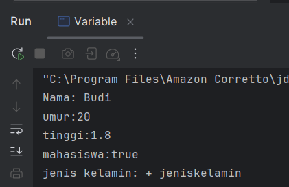
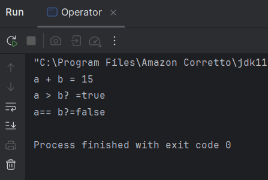
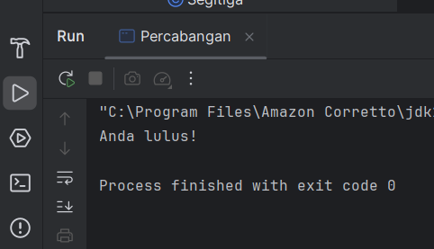
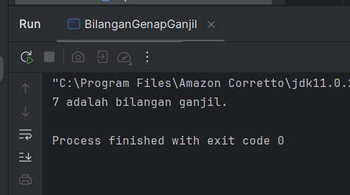
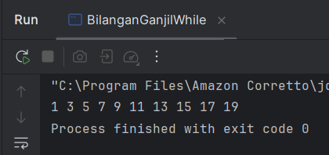
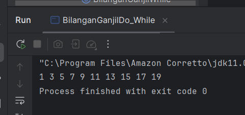
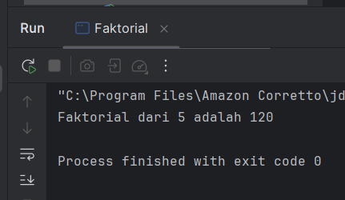
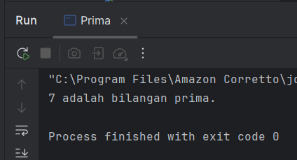
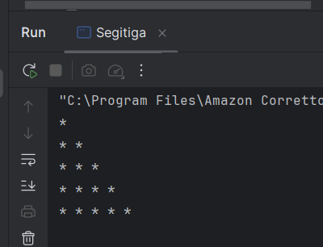

# Laporan Modul 1: Review Dasar Pemrograman Java
**Mata Kuliah:** Praktikum design Pattern
**Nama:** [Muna Nafisa]  
**NIM:** [2024573010048]  
**Kelas:** [TI2A]

## 1. Abstrak
Java adalah bahasa pemrograman berorientasi objek yang populer dan banyak digunakan untuk pengembangan aplikasi desktop, web, dan mobile. Java menggunakan sintaks yang mirip dengan C++ tetapi dirancang untuk lebih mudah dipahami dan digunakan.

Untuk memulai pemrograman Java, Anda perlu:

JDK (Java Development Kit): Berisi compiler dan tools untuk mengembangkan program Java.
IDE (Integrated Development Environment): Seperti IntelliJ IDEA, Eclipse, atau NetBeans untuk menulis dan menjalankan kode.ternal suatu komponen tanpa memengaruhi komponen lain yang berinteraksi dengan komponen tersebut, asalkan interface yang digunakan tetap konsisten.

#### Langkah Praktikum

**Praktikum 1

1. Buat sebuah package baru di dalam folder src dengan cara klik kanan pada folder src kemudian pilih New -> Package. Beri nama modul_1.
2. Buat Sebuah class didalam package modul_1 dengan cara klik kanan dan pilih New -> Java Class. Beri nama HelloWorld
   3.  Isikan kode dibawah ini.

           package Praktikum_1;
        
           public class HelloWorld {
           public static void main (String[] args){
           System.out.println("Hello, World!!");
           }
           }
                    
4. Jalankan program 

## 2. Variabel dan Tipe Data

Variabel digunakan untuk menyimpan data dalam program.

### Langkah praktikum

1. Buat sebuah class baru di dalam package modul_1 dan beri nama Variable
2. Tuliskan kode berikut:

         package Praktikum_1;
        
         public class Variable {
         public static void main(String [] args) {
         int umur = 20;
         double tinggi = 1.80;
         boolean isMahasiswa = true;
         char jeniskelamin = 'L';
         String nama = "Budi";

         System.out.println("Nama: " + nama );
         System.out.println("umur:" +umur);
         System.out.println("tinggi:" +tinggi);
         System.out.println("mahasiswa:" + isMahasiswa);
         System.out.println("jenis kelamin: + jeniskelamin");
             }
         }

3. Jalankan program nya untuk melihat hasil.

**Latihan**

1. Buatlah program untuk menampilkan data diri anda yang lengkap dengan attribut seperti berikut:
   Nama Lengkap, Tempat Lahir, Tanggal Lahir, Golongan Darah, Umur,
   Tinggi Badan, Jenis Kelamin, Agama, Pekerjaan.

            package Praktikum_1.Latihan;
    
        public class DataDiri {
    
            public static void main(String[] args) {
    
                String namaLengkap = "Muna nafisa";
                String tempatLahir = "Kandang";
                String tanggalLahir = "12 Juli 2006";
                String golonganDarah = "O";
                int umur = 20;
                double tinggiBadan =1.55;
                String jenisKelamin = "perempuan";
                String agama = "Islam";
                String pekerjaan = "Mahasiswa";
    
                System.out.println("===== DATA DIRI =====");
                System.out.println("Nama Lengkap  : " + namaLengkap);
                System.out.println("Tempat Lahir  : " + tempatLahir);
                System.out.println("Tanggal Lahir : " + tanggalLahir);
                System.out.println("Golongan Darah: " + golonganDarah);
                System.out.println("Umur          : " + umur + " tahun");
                System.out.println("Tinggi Badan  : " + tinggiBadan + " cm");
                System.out.println("Jenis Kelamin : " + jenisKelamin);
                System.out.println("Agama         : " + agama);
                System.out.println("Pekerjaan     : " + pekerjaan);
            }
        }

**output**

## 3. Operator dan Expressi 

Operator digunakan untuk melakukan operasi pada variabel dan nilai. Jenis operator:

Aritmatika: +, -, *, /, %

Perbandingan: ==, !=, >, <, >=, <=

Logika: && (AND), || (OR), ! (NOT)

### Langkah Praktikum

1. Buat sebuah class baru di dalam package modul_1 dan beri nama Operator
2. Tuliskan kode berikut:

        package Praktikum_1;
        
        public class Operator {
        public static void main (String[] args) {
        int a = 10;
        int b = 5;
        
                System.out.println("a + b = " + (a + b));
                System.out.println("a > b? =" + (a > b));
                System.out.println("a== b?=" + (a == b));
            }
        }

3. Jalankan program nya untuk melihat hasil.

**Latihan**

1. Buat program untuk menghitung luas persegi panjang (panjang * lebar)

        package Praktikum_1.Latihan;
        
        public class LuasPersegiPanjang {
        
            public static void main(String[] args) {
        
                int panjang = 10;
                int lebar = 5;
        
                int luas = panjang * lebar;
        
                System.out.println("Panjang = " + panjang);
                System.out.println("Lebar   = " + lebar);
                System.out.println("Luas Persegi Panjang = " + luas);
            }
        }
**output**

## 4. Percabangan (If-Else dan Switch-Case)

Percabangan digunakan untuk mengambil keputusan berdasarkan kondisi.

## Langkah Praktikum

1. Buat sebuah class baru di dalam package modul_1 dan beri nama Percabangan
2. Tuliskan kode berikut:

        package Praktikum_1;
        
        public class Percabangan {
        public static void main(String[] args) {
        int nilai = 85;
        
                if (nilai >= 75) {
                    System.out.println("Anda lulus!");
                } else {
                    System.out.println("Anda tidak lulus.");
                }
            }
        }

3. Jalankan program nya untuk melihat hasil.

**latihan**

1. Buat program untuk menentukan apakah suatu bilangan genap atau ganjil.

        package Praktikum_1.Latihan;
        
        public class BilanganGenapGanjil {
        
                public static void main(String[] args) {
        
                    int angka = 7;
        
                    if (angka % 2 == 0) {
                        System.out.println(angka + " adalah bilangan genap.");
                    } else {
                        System.out.println(angka + " adalah bilangan ganjil.");
                    }
        
                }
            }

**Output**

## 5. Perulangan (For, While, Do-While)

Perulangan digunakan untuk mengulang blok kode.

## langkah Praktikum

1. Buat sebuah class baru di dalam package modul_1 dan beri nama Perulangan
2. Tuliskan kode berikut:

        package Praktikum_1;
        
        public class Perulangan {
        public static void main(String[] args) {
        for (int i = 1; i <= 5; i++) {
        System.out.println("Iterasi ke-" + i);
        }
        }
        }

3. Jalankan program nya untuk melihat hasil.
   

**Latihan**

1. Buat program untuk mencetak bilangan ganjil dari 1 hingga 20. Buat 3 program dengan menggunakan for, while, do-while.

**menggunakan for**

    package Praktikum_1.Latihan;
    
    public class BilanganGanjilFor {
    public static void main(String[] args) {
    
            for (int i = 1; i <= 20; i++) {
                if (i % 2 != 0) {
                    System.out.print(i + " ");
                }
            }
    
        }
    }

**output**

**menggunakan while**

    package Praktikum_1.Latihan;
    
    public class BilanganGanjilWhile {
    
        public static void main(String[] args) {
    
            int i = 1;
    
            while (i <= 20) {
                if (i % 2 != 0) {
                    System.out.print(i + " ");
                }
                i++;
            }
    
        }
    }

**output**

**menggunakan Do-While**

    package Praktikum_1.Latihan;
    
    public class BilanganGanjilDo_While {
    public static void main(String[] args) {
    
                int i = 1;
    
                do {
                    if (i % 2 != 0) {
                        System.out.print(i + " ");
                    }
                    i++;
                } while (i <= 20);
    
            }
        }

**output**

## 6. Practice Problem dan Solusinya

Practice Problem:

Buat program untuk menghitung faktorial dari suatu bilangan.

Buat program untuk mengecek apakah suatu bilangan adalah bilangan prima.

Buat program untuk mencetak pola segitiga menggunakan *.

**Solusi**

1. Buat sebuah class baru di dalam package modul_1 dan beri nama Factorial dan isikan kode berikut. 

Kemudian jalankan untuk melihat hasilnya.

    package Praktikum_1;
    
    public class Faktorial {
    public static void main(String[] args) {
    int n = 5;
    int hasil = 1;
    
                for (int i = 1; i <= n; i++) {
                    hasil *= i;
                }
    
                System.out.println("Faktorial dari " + n + " adalah " + hasil);
            }
        }
**Output**

2. Buat sebuah class baru di dalam package modul_1 dan beri nama Prima dan isikan kode berikut. Kemudian jalankan untuk melihat hasilnya.

        package Praktikum_1;
        
        public class Prima {
        public static void main(String[] args) {
        int n = 7;
        boolean isPrima = true;
        
                    for (int i = 2; i <= n / 2; i++) {
                        if (n % i == 0) {
                            isPrima = false;
                            break;
                        }
                    }
        
                    System.out.println(n + (isPrima ? " adalah bilangan prima." : " bukan bilangan prima."));
                }
            }

**Output**

3. Buat sebuah class baru di dalam package modul_1 dan beri nama Segitiga dan isikan kode berikut. Kemudian jalankan untuk melihat hasilnya.

        package Praktikum_1;
        
        public class Segitiga {
        public static void main(String[] args) {
        int tinggi = 5;
        
                    for (int i = 1; i <= tinggi; i++) {
                        for (int j = 1; j <= i; j++) {
                            System.out.print("* ");
                        }
                        System.out.println();
                    }
                }
            }

**Output**

#### Analisa dan Pembahasan

**PRAKTIKUM 1**

**1.faktorial**

Program Faktorial digunakan untuk menghitung nilai faktorial dari sebuah bilangan.

Penjelasan:

1. int n = 5;

Menentukan bilangan yang akan dihitung faktorialnya, yaitu 5.

2. int hasil = 1;

Variabel hasil digunakan untuk menyimpan hasil perkalian faktorial, dimulai dari 1.

3. for (int i = 1; i <= n; i++)

Perulangan dari 1 sampai 5.

4. hasil *= i;

Setiap perulangan, nilai hasil dikalikan dengan i sehingga membentuk faktorial.

Perhitungannya:
1 × 1 × 2 × 3 × 4 × 5 = 120

5. System.out.println(...)

Menampilkan hasil faktorial ke layar.

**2. Hello world**

Program HelloWorld adalah program sederhana untuk menampilkan teks ke layar.

Penjelasan:

1. package Praktikum_1;

Menunjukkan bahwa program berada dalam package Praktikum_1.

2. public class HelloWorld

Mendefinisikan kelas bernama HelloWorld.

3. public static void main(String[] args)

Merupakan method utama yang pertama kali dijalankan saat program dieksekusi.

4. System.out.println("Hello, World!!");

Perintah untuk menampilkan tulisan "Hello, World!!" ke layar.

**3.operator**

Program Operator digunakan untuk menunjukkan penggunaan operator aritmatika dan operator perbandingan dalam Java.

Penjelasan:

1. int a = 10; dan int b = 5;

Mendeklarasikan dua variabel bertipe integer, yaitu a = 10 dan b = 5.

2. System.out.println("a + b = " + (a + b));

Menggunakan operator aritmatika (+) untuk menjumlahkan a dan b.

Hasil: 10 + 5 = 15

3. System.out.println("a > b? =" + (a > b));

Menggunakan operator perbandingan (>) untuk mengecek apakah a lebih besar dari b.

Hasil: true karena 10 > 5.

4. System.out.println("a== b?=" + (a == b));

Menggunakan operator perbandingan (==) untuk mengecek apakah a sama dengan b.

Hasil: false karena 10 tidak sama dengan 5.

**4.Percabangan**

Program Percabangan digunakan untuk menunjukkan penggunaan percabangan if-else dalam Java.

Penjelasan:

1. int nilai = 85;

Mendeklarasikan variabel nilai dengan nilai 85.

2. if (nilai >= 75)

Mengecek kondisi apakah nilai lebih besar atau sama dengan 75.

3. System.out.println("Anda lulus!");

Jika kondisi benar, maka program menampilkan "Anda lulus!".

4. else

Jika kondisi salah (nilai kurang dari 75), maka program menjalankan bagian else.

5. System.out.println("Anda tidak lulus.");

Menampilkan "Anda tidak lulus."

**5.perulangan**

Program Perulangan digunakan untuk menunjukkan penggunaan perulangan for dalam Java.

Penjelasan:

1. for (int i = 1; i <= 5; i++)

Perulangan dimulai dari i = 1, berjalan selama i ≤ 5, dan setiap iterasi i bertambah 1.

2. System.out.println("Iterasi ke-" + i);

Setiap perulangan akan menampilkan nomor iterasi ke layar.

**6.prima**

Program Prima digunakan untuk menentukan apakah suatu bilangan merupakan bilangan prima atau bukan.

Penjelasan:

1. int n = 7;

Menentukan bilangan yang akan diperiksa, yaitu 7.

2. boolean isPrima = true;

Variabel isPrima digunakan sebagai penanda apakah bilangan tersebut prima (awal diasumsikan true).

3. for (int i = 2; i <= n / 2; i++)

Perulangan untuk mengecek apakah n habis dibagi bilangan dari 2 sampai n/2.

4. if (n % i == 0)

Jika n habis dibagi i, maka bukan bilangan prima.

5. isPrima = false; dan break;

Mengubah nilai isPrima menjadi false dan menghentikan perulangan.

6. System.out.println(...)

Menampilkan hasil apakah n bilangan prima atau bukan menggunakan operator ternary (? :).

**7.segitiga**

Program Segitiga digunakan untuk menampilkan pola segitiga menggunakan tanda bintang (*).

Penjelasan:

1. int tinggi = 5;

Menentukan tinggi segitiga yaitu 5 baris.

2. for (int i = 1; i <= tinggi; i++)

Perulangan baris dari 1 sampai 5.

3. for (int j = 1; j <= i; j++)

Perulangan kolom untuk mencetak bintang sesuai nomor baris.

4. System.out.print("* ");

Mencetak tanda * tanpa pindah baris.

5. System.out.println();

Digunakan untuk pindah ke baris berikutnya setelah satu baris selesai.

**8.variabel**

Program Variable digunakan untuk menunjukkan penggunaan berbagai tipe data (variabel) dalam Java dan menampilkannya ke layar.

Penjelasan:

1. int umur = 20; → Variabel bertipe int untuk menyimpan umur.

2. double tinggi = 1.80; → Variabel bertipe double untuk menyimpan tinggi badan.

3. boolean isMahasiswa = true; → Variabel boolean untuk status mahasiswa.

4. char jeniskelamin = 'L'; → Variabel char untuk menyimpan satu karakter (L = laki-laki).

5. String nama = "Budi"; → Variabel String untuk menyimpan teks nama.

Perintah System.out.println() digunakan untuk menampilkan nilai dari setiap variabel ke layar.

### analisa Latihan

**1.Bilangan ganjil do_while**

Program BilanganGanjilDo_While digunakan untuk menampilkan bilangan ganjil dari 1 sampai 20 menggunakan perulangan do-while.

Penjelasan:

1. int i = 1;

Variabel i sebagai nilai awal perulangan dimulai dari 1.

2. do { ... } while (i <= 20);

Perulangan do-while akan menjalankan perintah terlebih dahulu, kemudian mengecek kondisi selama i ≤ 20.

3. if (i % 2 != 0)

Mengecek apakah i adalah bilangan ganjil.

Bilangan ganjil memiliki sisa bagi tidak sama dengan 0 ketika dibagi 2.

4. System.out.print(i + " ");

Menampilkan bilangan ganjil dalam satu baris dipisahkan spasi.

5. i++;

Menambah nilai i setiap perulangan.

**2.Bilangan ganjil for**

Program BilanganGanjilFor digunakan untuk menampilkan bilangan ganjil dari 1 sampai 20 menggunakan perulangan for.

Penjelasan:

1. for (int i = 1; i <= 20; i++)

Perulangan dimulai dari i = 1 sampai i ≤ 20, dan setiap iterasi i bertambah 1.

2. if (i % 2 != 0)

Mengecek apakah i adalah bilangan ganjil (sisa bagi 2 tidak sama dengan 0).

3. System.out.print(i + " ");

Jika bilangan ganjil, maka ditampilkan ke layar dengan spasi di antara angka.

**3.Bilangan ganjil while**

Program BilanganGanjilWhile digunakan untuk menampilkan bilangan ganjil dari 1 sampai 20 menggunakan perulangan while.

Penjelasan:

1. int i = 1;

Variabel i sebagai nilai awal perulangan dimulai dari 1.

2. while (i <= 20)

Perulangan while akan berjalan selama i kurang dari atau sama dengan 20.

3. if (i % 2 != 0)

Mengecek apakah i adalah bilangan ganjil (sisa pembagian 2 tidak sama dengan 0).

4. System.out.print(i + " ");

Jika bilangan ganjil, maka ditampilkan ke layar dengan spasi.

5. i++;

Nilai i ditambah 1 setiap perulangan.

**4.bilangan genap ganjil**

Program BilanganGenapGanjil digunakan untuk menentukan apakah suatu bilangan termasuk genap atau ganjil.

Penjelasan:

1. int angka = 7;

Variabel angka menyimpan nilai yang akan diperiksa, yaitu 7.

2. if (angka % 2 == 0)

Mengecek apakah angka habis dibagi 2. Jika iya, maka bilangan tersebut genap.

3. else

Jika tidak habis dibagi 2, maka bilangan tersebut ganjil.

4. System.out.println(...)

Menampilkan hasil pengecekan ke layar.

**5.Datadiri**

Program DataDiri digunakan untuk menyimpan dan menampilkan data diri seseorang menggunakan beberapa variabel.

Penjelasan:

1. Beberapa variabel dideklarasikan untuk menyimpan data, seperti:

- String namaLengkap → menyimpan nama lengkap.

- String tempatLahir dan String tanggalLahir → menyimpan tempat dan tanggal lahir.

- String golonganDarah → menyimpan golongan darah.

- int umur → menyimpan umur.

- double tinggiBadan → menyimpan tinggi badan.

- String jenisKelamin, agama, pekerjaan → menyimpan informasi tambahan tentang diri.

2. System.out.println() digunakan untuk menampilkan setiap data ke layar dengan format yang rapi.

**6.Luas persegi panjang**

Program LuasPersegiPanjang digunakan untuk menghitung luas persegi panjang.

Penjelasan:

1. int panjang = 10;

Menyimpan nilai panjang persegi panjang yaitu 10.

2. int lebar = 5;

Menyimpan nilai lebar persegi panjang yaitu 5.

3. int luas = panjang * lebar;

Menghitung luas persegi panjang dengan rumus:

luas = panjang × lebar.

4. System.out.println()

Digunakan untuk menampilkan nilai panjang, lebar, dan hasil luas ke layar.

## 3. Kesimpulan

praktikum ini mahasiswa mempelajari dasar-dasar pemrograman menggunakan bahasa Java. Mahasiswa memahami struktur dasar program Java seperti package, class, dan method main sebagai bagian utama dalam menjalankan program.

Selain itu, mahasiswa juga mempelajari penggunaan variabel dan tipe data seperti int, double, boolean, char, dan String, serta penggunaan operator aritmatika dan operator perbandingan dalam proses perhitungan. Praktikum ini juga memperkenalkan percabangan (if-else) dan perulangan (for, while, dan do-while) untuk mengontrol jalannya program.

Melalui beberapa latihan program sederhana, mahasiswa dapat memahami cara membuat program seperti menampilkan data diri, menentukan bilangan genap dan ganjil, menampilkan bilangan ganjil, menghitung luas, membuat pola bintang, serta menentukan bilangan prima. Dengan praktikum ini, mahasiswa diharapkan dapat memahami konsep dasar pemrograman Java dan mampu membuat program sederhana dengan benar sebagai dasar untuk materi pemrograman selanjutnya.

## 4. Referensi

https://hackmd.io/@mohdrzu/BkBn4sEcyl